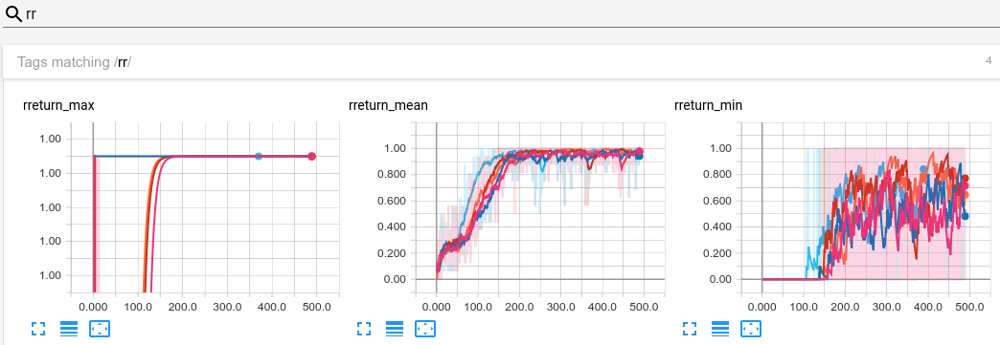

# DSIM:Discover Skills and Learn Intrinsic Motivation for Goal-Conditioned Policy

Code for [Discover Skills and Learn Intrinsic Motivation for Goal-Conditioned Policy](https://arxiv.org/abs/2102.09430).

Our WDSIM framework mainly includes three stages.It can be summarized as follows:
(1)Efficient exploration stage with a fixed representation coder in the original environment.Efficient explo-
ration is one of the important steps to improve sample efficiency. In the first stage, we use an exploration
policy π∗ to interact with the environment to obtain a series of transitions by a intrinsic reward. 
At the same time, in order to solve various types of goal input types, we adopt the method of encoding observation and random sampling transitions in the transitions at this stage.
(2)Skill discovery and learning stage. After exploring and collecting experience data
In the first stage,we train variable auto encoders(VQ-VAE)to model p (z|τ) and p(τ|z), where τ represents the vector representation of the entire transition,and learn the list discovery skills of a potential variable z.Then maximize the mutual information between the transitions τ and potential variables z.At the same time, we will train a high-level policy π(a|s, z) to learn the skill list and collect 'final' trajectories guided down-stream policy learning through agent rollout.
(3)learning downstream goal-condition policy π(a|s,g′),where g′=q(g) is calculated by minimizing D_KL(q(g),q(z)).

We also provide raw data(.csv) and code for visualization in the `data` directory.

If you find this repository useful for your research, please cite:
```
@inproceedings{seo2021DSIM,
  title={Discover Skills and Learn Intrinsic Motivation for Goal-Conditioned Policy},
  author={Xing Lei,JinXin Liu},
  booktitle={},
  year={2023}
}
```
## Installation

1. Clone this repository.

2. Install `gym-minigrid` environments and `torch-ac` RL algorithms:

```
pip3 install -r rl-starter-fils/requirements.txt
```

**Note:** If you want to modify `torch-ac` algorithms, you will need to rather install a cloned version, i.e.:
```
git clone https://github.com/lcswillems/torch-ac.git
cd torch-ac
pip3 install -e .
```

```
cd rl-starter-fils
```
## Example of use
#Baseline env list:Ant,Half_Cheetah,Hopper,Walker_2d,Fetch_push,Atari

Train, visualize and evaluate an agent on the `Half_Cheetah` environment:

<p align="center"></p>

1. Train the agent on the `Half_Cheetah` environment with PPO algorithm:

```
python3 -m scripts.train --algo ppo --env Half_Cheetah --model Half_Cheetah --save-interval 10 --frames 80000
```

<p align="center"></p>

2. Visualize agent's behavior:

```
python3 -m scripts.visualize --env Half_Cheetah --model Half_Cheetah
```

<p align="center"></p>

3. Evaluate agent's performance:

```
python3 -m scripts.evaluate --env Half_Cheetah --model Half_Cheetah
```

<p align="center"></p>

**Note:** More details on the commands are given below.

## Other examples

## Files

This package contains:
- scripts to:
  - train an agent \
  in `script/train.py` ([more details](#scripts-train))
  - visualize agent's behavior \
  in `script/visualize.py` ([more details](#scripts-visualize))
  - evaluate agent's performances \
  in `script/evaluate.py` ([more details](#scripts-evaluate))
- a default agent's model \
in `model.py` ([more details](#model))
- utilitarian classes and functions used by the scripts \
in `utils`

These files are suited for [`gym-minigrid`](https://github.com/maximecb/gym-minigrid) environments and [`torch-ac`](https://github.com/lcswillems/torch-ac) RL algorithms. They are easy to adapt to other environments and RL algorithms by modifying:
- `model.py`
- `utils/format.py`

<h2 id="scripts-train">rl-starter-files/scripts/train.py</h2>

An example of use:

```bash
python3 -m scripts.train --algo ppo --env Half_Cheetah --model Half_Cheetah --save-interval 10 --frames 80000
```

The script loads the model in `storage/Half_Cheetah` or creates it if it doesn't exist, then trains it with the PPO algorithm on the MiniGrid DoorKey environment, and saves it every 10 updates in `storage/Half_Cheetah`. It stops after 80 000 frames.

**Note:** You can define a different storage location in the environment variable `PROJECT_STORAGE`.

More generally, the script has 2 required arguments:
- `--algo ALGO`: name of the RL algorithm used to train
- `--env ENV`: name of the environment to train on

and a bunch of optional arguments among which:
- `--recurrence N`: gradient will be backpropagated over N timesteps. By default, N = 1. If N > 1, a LSTM is added to the model to have memory.
- `--text`: a GRU is added to the model to handle text input.
- ... (see more using `--help`)

During training, logs are printed in your terminal (and saved in text and CSV format):

<p align="center"></p>

**Note:** `U` gives the update number, `F` the total number of frames, `FPS` the number of frames per second, `D` the total duration, `rR:μσmM` the mean, std, min and max reshaped return per episode, `F:μσmM` the mean, std, min and max number of frames per episode, `H` the entropy, `V` the value, `pL` the policy loss, `vL` the value loss and `∇` the gradient norm.

During training, logs are also plotted in Tensorboard:

<p></p>

<h2 id="scripts-visualize">rl-starter-files/scripts/visualize.py</h2>

An example of use:

```
python3 -m scripts.visualize --env Half_Cheetah --model Half_Cheetah
```

<p align="center"></p>

In this use case, the script displays how the model in `storage/Half_Cheetah` behaves on the MiniGrid DoorKey environment.

More generally, the script has 2 required arguments:
- `--env ENV`: name of the environment to act on.
- `--model MODEL`: name of the trained model.

and a bunch of optional arguments among which:
- `--argmax`: select the action with highest probability
- ... (see more using `--help`)

<h2 id="scripts-evaluate">scripts/evaluate.py</h2>

An example of use:

```
python3 -m scripts.evaluate --env Half_Cheetah --model Half_Cheetah
```

<p align="center"></p>

In this use case, the script prints in the terminal the performance among 100 episodes of the model in `storage/DoorKey`.

More generally, the script has 2 required arguments:
- `--env ENV`: name of the environment to act on.
- `--model MODEL`: name of the trained model.

and a bunch of optional arguments among which:
- `--episodes N`: number of episodes of evaluation. By default, N = 100.
- ... (see more using `--help`)

<h2 id="model">model.py</h2>

The default model is discribed by the following schema:

<p align="center"></p>

By default, the memory part (in red) and the langage part (in blue) are disabled. They can be enabled by setting to `True` the `use_memory` and `use_text` parameters of the model constructor.

This model can be easily adapted to your needs.

